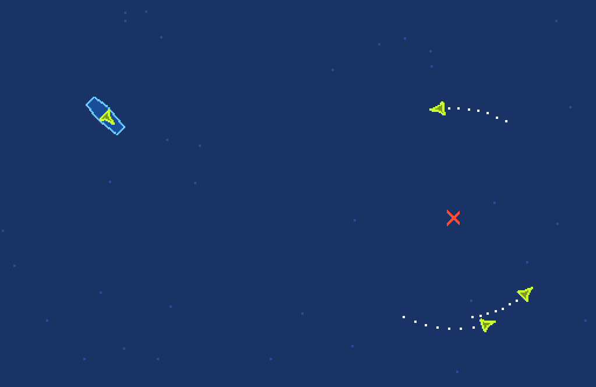

---

# 🚢 ShipGame

**ShipGame** — это симулятор управления авианосцем и его авиагруппой, написанный на Python. Ваша задача — управлять кораблём, ставить цели для самолётов и координировать их взлёты, полёты и посадки.

---

## 📸 Скриншот



---

## 🚀 Быстрый старт

1. **Клонируйте репозиторий:**
   ```bash
   git clone https://github.com/DoubleCitizen/ShipGame.git
   cd ShipGame
   ```

2. **Запустите игру:**
   ```bash
   python game.py
   ```

---

## 🎮 Управление

| Действие              | Клавиша |
|-----------------------|---------|
| Вперёд                | W / ↑   |
| Назад                 | S / ↓   |
| Влево                 | A / ←   |
| Вправо                | D / →   |
| Поставить цель (мышь) | ЛКМ     |
| Взлет самолёта (мышь) | ПКМ     |
| Перезапуск игры       | Пробел  |

---

## 🛠️ Структура проекта

```
ShipGame/
│
├── entities/           # Основные игровые сущности (корабль, самолёт, маркер цели)
│   ├── aircraft.py
│   ├── base_entity.py
│   ├── ship.py
│   ├── target_marker.py
│   └── __init__.py
│
├── libs/               # Абстракция над внешним фреймворком
│   ├── framework.py
│   └── __init__.py
│
├── game.py             # Главная точка входа
├── math_utils.py       # Векторная математика
├── params.py           # Параметры игры и состояния ИИ
└── README.md           # Этот файл
```

---

## 🧩 Краткое описание модулей

- **game.py** — основной игровой цикл и интерфейс.
- **entities/** — игровые объекты:
  - `ship.py` — логика корабля и управления авиагруппой.
  - `aircraft.py` — поведение самолёта, ИИ, взлёт/посадка.
  - `target_marker.py` — маркер цели для самолётов.
  - `base_entity.py` — базовый класс для всех сущностей.
- **libs/framework.py** — обёртка над внешним графическим/физическим фреймворком.
- **math_utils.py** — класс Vector2 и базовые векторные операции.
- **params.py** — все параметры игры и состояния ИИ.

---

## 🤖 Искусственный интеллект

Самолёты управляются простым ИИ:
- Летят к цели, кружат вокруг неё, возвращаются на корабль с задней части.
- Автоматически выравниваются для посадки.
- После посадки проходят заправку перед следующим взлётом.

---

## ⚙️ Требования

- Python 2.7
- Модули `framework32` или `framework64` (должны быть доступны в вашей системе)
- ОС: Windows

---

## 👨‍💻 Авторы

- [DoubleCitizen](https://github.com/DoubleCitizen)

---

**Приятной игры!**

